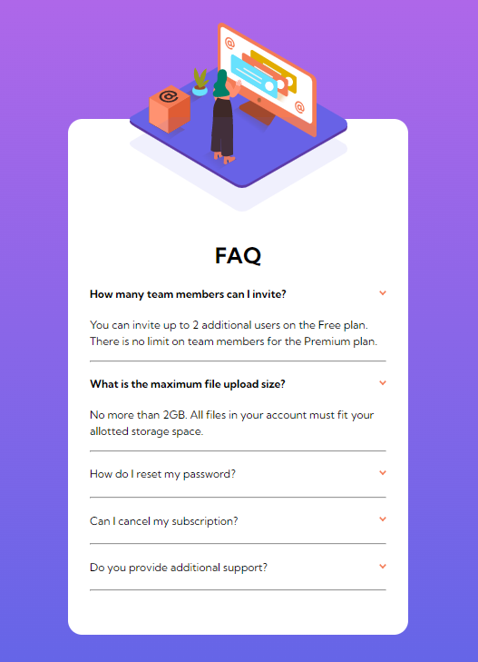
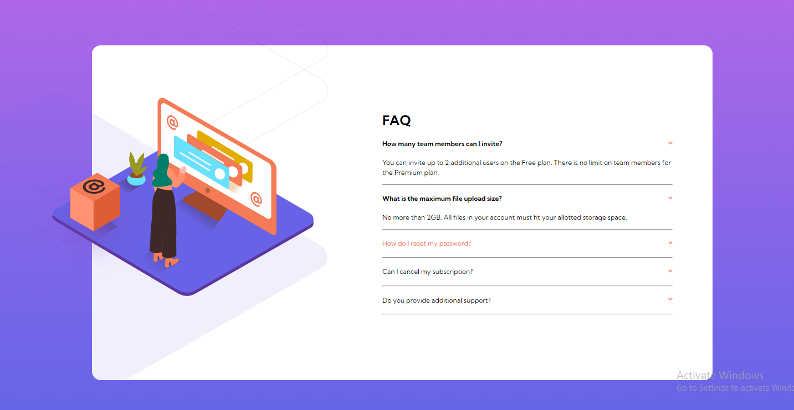

# Frontend Mentor - FAQ accordion card solution

This is a solution to the [FAQ accordion card challenge on Frontend Mentor](https://www.frontendmentor.io/challenges/faq-accordion-card-XlyjD0Oam). Frontend Mentor challenges help you improve your coding skills by building realistic projects. 

## Table of contents

- [Overview](#overview)
  - [The challenge](#the-challenge)
  - [Screenshot](#screenshot)
  - [Links](#links)
- [My process](#my-process)
  - [Built with](#built-with)
  - [What I learned](#what-i-learned)
  - [Continued development](#continued-development)
  - [Useful resources](#useful-resources)
- [Author](#author)
- [Acknowledgments](#acknowledgments)

## Overview
This is an FAQ accordion buiilt without JS, just HTML and CSS.

### The challenge

Users should be able to:

- View the optimal layout for the component depending on their device's screen size
- See hover states for all interactive elements on the page
- Hide/Show the answer to a question when the question is clicked

### Screenshot




### Links

- Solution URL: [Solution](https://github.com/Maysummer/FAQ-accordion-card)
- Live Site URL: [Live site](https://maysummer.github.io/FAQ-accordion-card/)

## My process

I started finding out how to build an accordion normally then how to use CSS classes to build an accordion. Afterwards I wrote the HTML file then moved forward to the CSS. I built the mobile view first then moved on to desktop view. I had to go back a lot to edit my HTML file because the desktop view caused me to make a lot of changes.
I constantly took note f the given design file throughout the entire process.

### Built with

- CSS custom properties
- Flexbox
- CSS Grid
- Mobile-first workflow

### What I learned

Creating an accordion with just CSS. Using different fonts.

```css
input + label + .content {
    display: none;
}

input:checked + label {
    font-weight: bold;
}

input:checked + label + .content {
    display: block;
}
```

### Continued development

Alignment

### Useful resources

- [Supfort](https://supfort.com/pure-css-accordion-without-javascript) - This is an amazing article which helped me with creating the accordion without JS. I'd recommend it to anyone who wants to try it out.

## Author

- Frontend Mentor - [@Maysummer](https://www.frontendmentor.io/profile/Maysummer)

## Acknowledgments

- [Anu](https://github.com/Hannah-28)
- [Cornerstone](https://github.com/Cornerstone-04)
